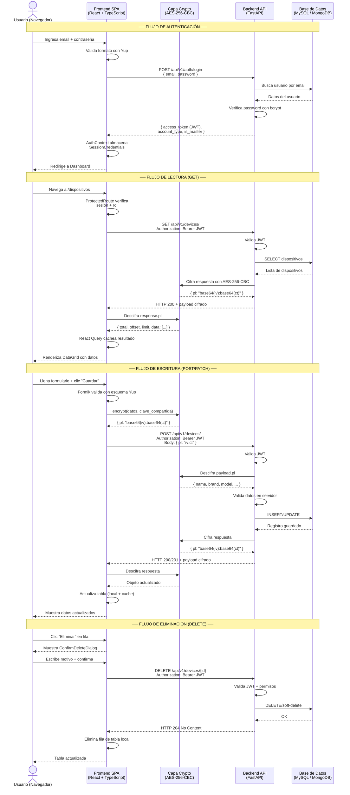
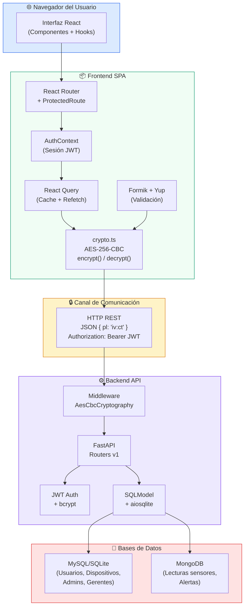
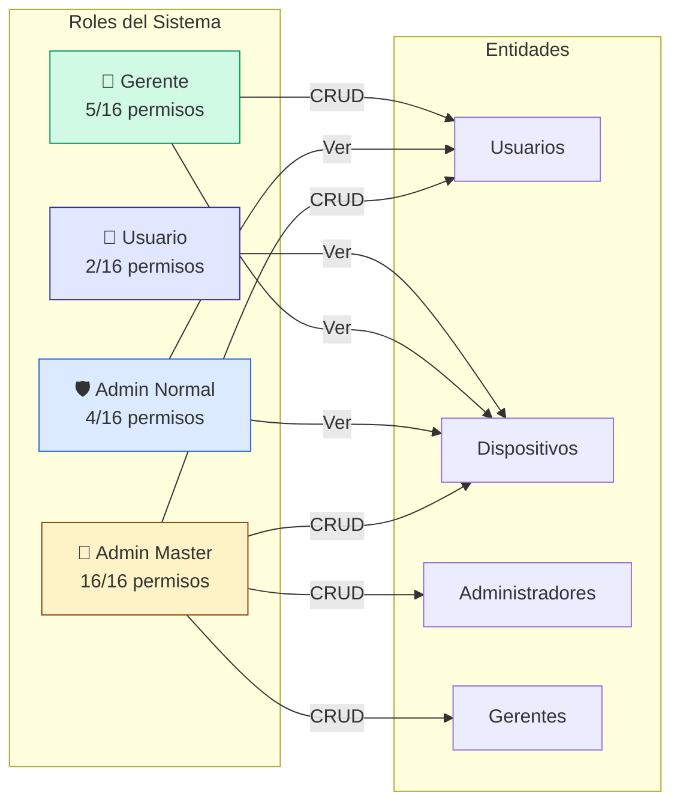

# Diagrama de Comunicación — Frontend IoT Platform

Este documento contiene el diagrama de secuencia que ilustra la comunicación completa entre el navegador, el frontend SPA, la capa de cifrado AES-256-CBC, el backend FastAPI y las bases de datos.

## Diagrama de Secuencia

## Diagrama de Arquitectura

## Diagrama de Roles y Permisos

