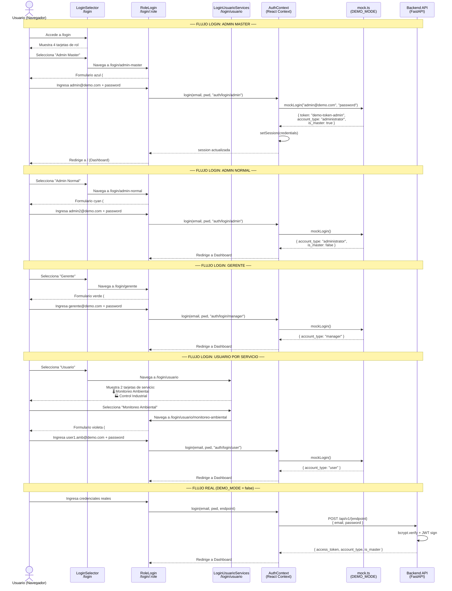
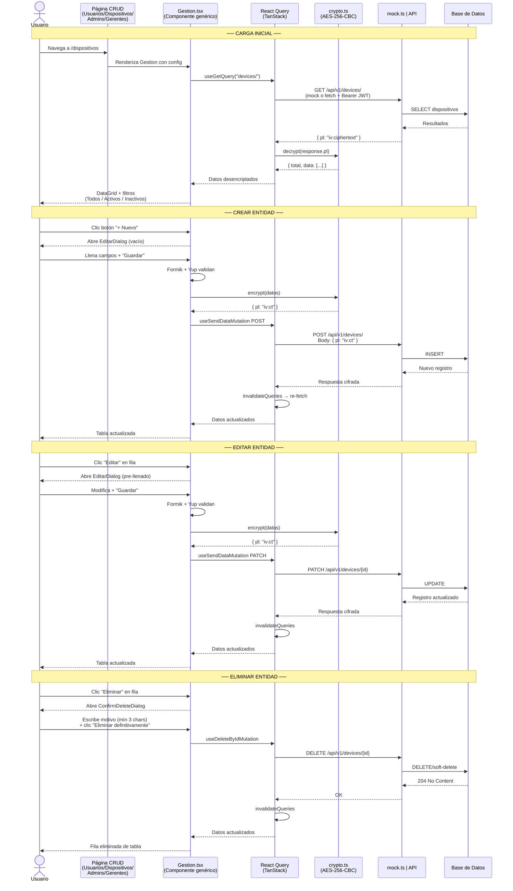
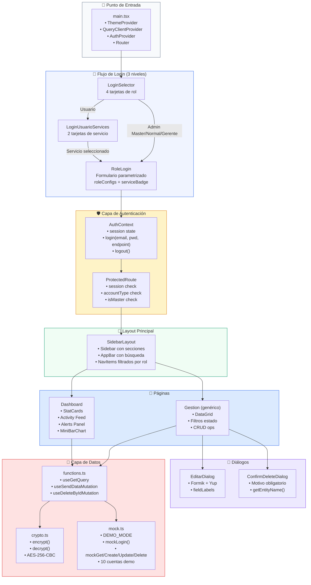
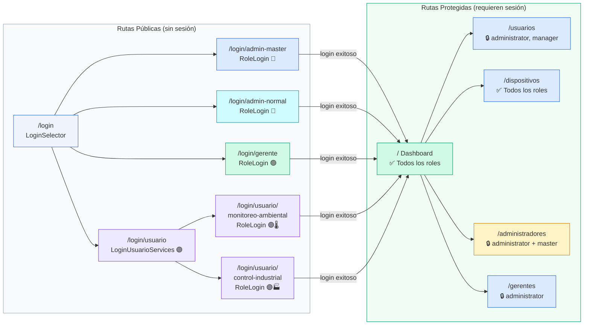

# Diagrama de Comunicación — Frontend IoT Platform (Actualizado)

Este documento contiene los diagramas de comunicación actualizados que ilustran la interacción entre todos los componentes del frontend, incluyendo el sistema de login separado por rol y servicio.

---

## 1. Comunicación de Autenticación por Rol

---

## 2. Comunicación de Datos (CRUD completo)

---

## 3. Comunicación Interna de Componentes

---

## 4. Mapa de Rutas y Comunicación entre Vistas

---

## Resumen de Endpoints por Login

| Ruta del Login | Endpoint API | Tipo de cuenta |
|---|---|---|
| `/login/admin-master` | `POST /api/v1/auth/login/admin` | `administrator` (master) |
| `/login/admin-normal` | `POST /api/v1/auth/login/admin` | `administrator` (normal) |
| `/login/gerente` | `POST /api/v1/auth/login/manager` | `manager` |
| `/login/usuario/monitoreo-ambiental` | `POST /api/v1/auth/login/user` | `user` |
| `/login/usuario/control-industrial` | `POST /api/v1/auth/login/user` | `user` |
