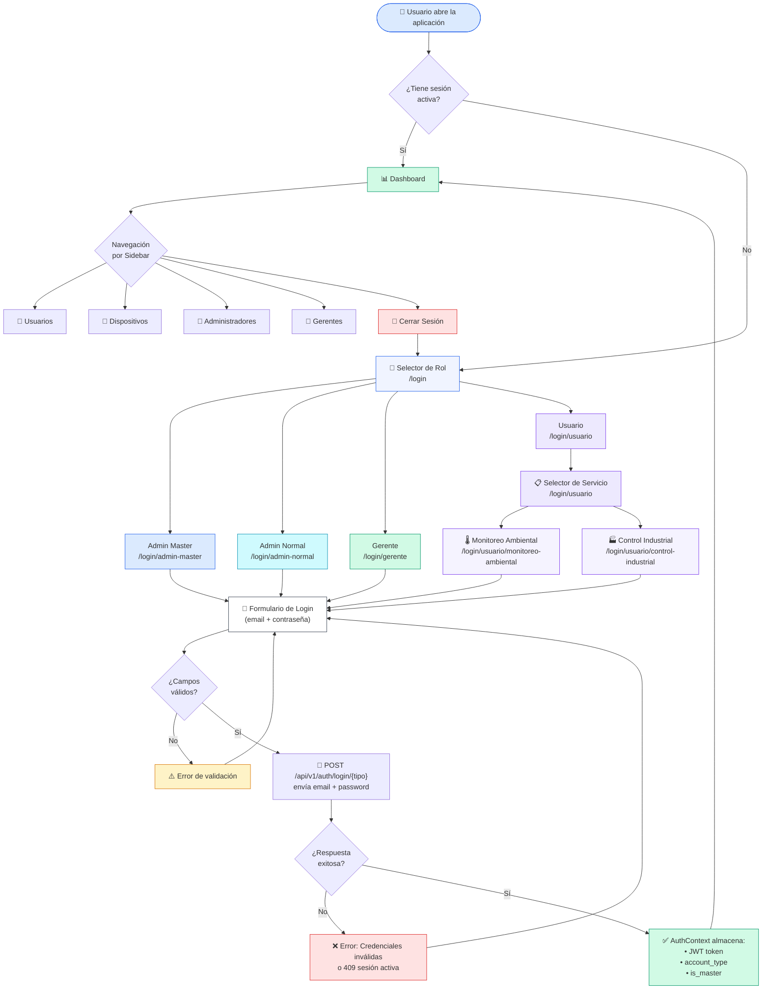
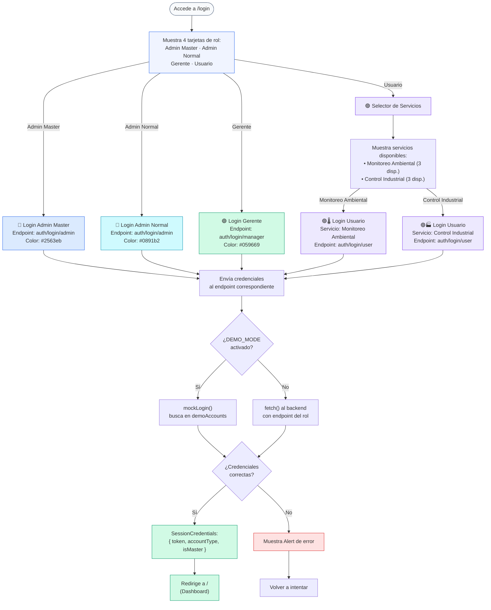
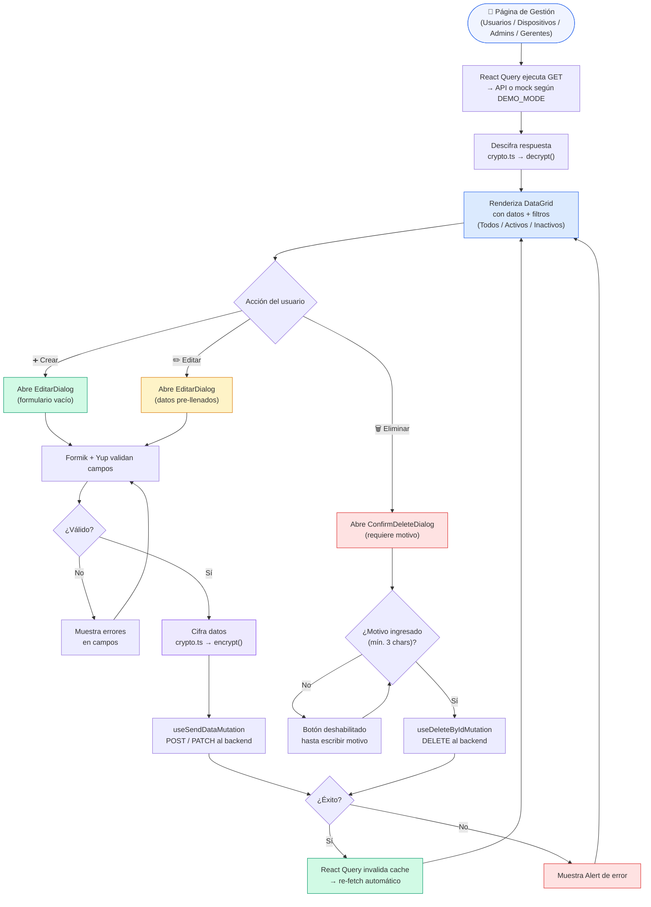
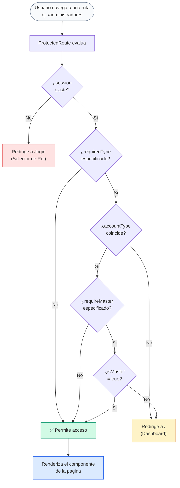

# Diagrama de Flujo — Frontend IoT Platform

Este documento contiene los diagramas de flujo que describen el funcionamiento completo del frontend, incluyendo el sistema de login separado por rol y por servicio.

---

## 1. Flujo General de Navegación

---

## 2. Flujo de Autenticación por Rol (Detallado)

---

## 3. Flujo de Operaciones CRUD

---

## 4. Flujo de Protección de Rutas

---

## Leyenda de Colores

| Color | Significado |
|---|---|
| 🔵 Azul `#2563eb` | Admin Master |
| 🔷 Cyan `#0891b2` | Admin Normal |
| 🟢 Verde `#059669` | Gerente (Manager) |
| 🟣 Violeta `#7c3aed` | Usuario (User) |
| 🟡 Amarillo `#d97706` | Advertencias / Edición |
| 🔴 Rojo `#dc2626` | Errores / Eliminación |

## Cuentas Demo

| Rol | Login | Email | Contraseña |
|---|---|---|---|
| Admin Master | `/login/admin-master` | `admin@demo.com` | `password` |
| Admin Normal | `/login/admin-normal` | `admin2@demo.com` | `password` |
| Gerente | `/login/gerente` | `gerente@demo.com` | `password` |
| Usuario — Monitoreo Ambiental | `/login/usuario/monitoreo-ambiental` | `user1.amb@demo.com` | `password` |
| Usuario — Monitoreo Ambiental | `/login/usuario/monitoreo-ambiental` | `user2.amb@demo.com` | `password` |
| Usuario — Control Industrial | `/login/usuario/control-industrial` | `user1.ind@demo.com` | `password` |
| Usuario — Control Industrial | `/login/usuario/control-industrial` | `user2.ind@demo.com` | `password` |
